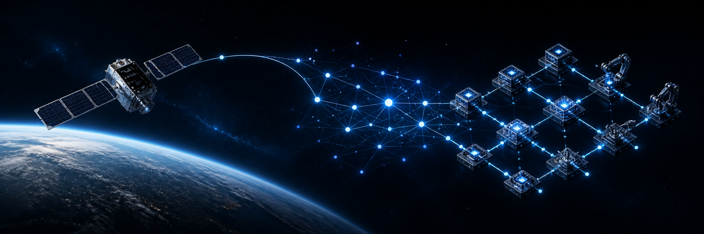

  

  <a href="https://www.linkedin.com/in/ysasiwat">LinkedIn</a>
  &nbsp;&middot;&nbsp;
  <a href="https://github.com/ysasiwat?tab=repositories">Repositories</a>
  &nbsp;&middot;&nbsp;
  Chonburi, Thailand

I build dependable tools where **space technology**, **software systems**, and **applied AI** meet. My work focuses on turning complex engineering processes into systems that are easier to operate, verify, and maintain.

## Focus

- **Space & embedded systems** — interfaces, timing, telemetry, and operational tooling.
- **Applied AI** — agent workflows, knowledge systems, and evidence-backed automation.
- **Engineering platforms** — reproducible tooling, CI, documentation, and maintainable architecture.

## Working principles

`Evidence before claims` &nbsp;·&nbsp; `Reliability by design` &nbsp;·&nbsp; `Automate the repeatable` &nbsp;·&nbsp; `Document the decisions`

I am currently preparing selected engineering work for public release. New repositories will emphasize clear problem statements, reproducible setup, design rationale, and verifiable results.

## GitHub activity

  

Account overview · Updated automatically twice a week with <a href="https://github.com/lowlighter/metrics">lowlighter/metrics</a>.
